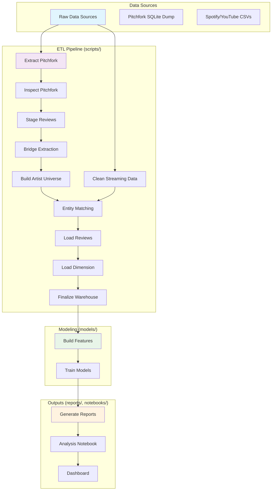

# Architecture Overview

## Data Pipeline Flow

## Component Details

### Data Sources
- **Pitchfork**: SQLite database export (~34K reviews)
- **Spotify/YouTube**: CSV files with streaming metrics and audio features

### ETL Pipeline Stages
1. **Extract Pitchfork** (`scripts/extract_pitchfork.py`): Exports SQLite to CSVs with SHA256 manifest
2. **Inspect Pitchfork** (`scripts/inspect_pitchfork.py`): Validates data quality
3. **Stage Reviews** (`scripts/stage_reviews.py`): Normalizes review data
4. **Bridge Extraction** (`scripts/make_review_artists_bridge.py`): Handles multi-artist reviews
5. **Build Artist Universe** (`scripts/build_artist_universe.py`): Aggregates Pitchfork artists
6. **Clean Streaming Data** (`scripts/clean_spotify_youtube.py`): Deduplicates and cleans streaming data
7. **Entity Matching** (`scripts/match_artists.py`): Fuzzy matches artists across sources
8. **Load Reviews** (`scripts/load_reviews_and_bridge.py`): Populates staging tables
9. **Load Dimension** (`scripts/load_dim_artist.py`): Creates unified artist dimension
10. **Finalize** (`scripts/stage_to_sqlite.py` + `scripts/validate_dw.py`): Builds warehouse and enforces data contracts

### Data Warehouse Schema
- **Core Tables**: `pitchfork_reviews`, `pitchfork_review_artists`, `dim_artist`, `spotify_youtube_clean`
- **Views**: 6 semantic views for analysis (defined in `sql/dw/create_views.sql`): `vw_review_with_artist`, `vw_unmatched_artists`, `vw_artist_summary`, `vw_artist_streams`, `vw_artist_critics_vs_streams`, `vw_artist_coverage_by_year`

### Modeling Pipeline
- **Feature Engineering** (`models/build_features.py`): Creates 14-feature dataset
- **Model Training** (`models/train_baseline.py`): Linear Regression (R²=0.32) and Random Forest (R²=0.56)

### Outputs
- **Reports**: Metrics, feature importance, predictions, model card
- **Notebook**: Exploratory analysis with visualizations
- **Dashboard**: Streamlit app (`dashboard.py`) for interactive exploration

## Key Design Decisions

- **Idempotent Operations**: All scripts can be re-run safely with backups and changelogs
- **Data Contracts**: Explicit validation rules enforced at pipeline end
- **Conservative Matching**: Prioritizes accuracy over coverage in artist matching
- **Normalized Warehouse**: Kimball-style design for analytical flexibility
- **Defensive Coding**: Extensive error handling, logging, and validation

## Technology Stack

| Component | Technology |
|-----------|------------|
| Language | Python 3.10+ |
| Data Processing | Pandas |
| Database | SQLite |
| Machine Learning | Scikit-learn |
| Testing | Pytest |
| Code Quality | Black, Flake8, Isort |
| CI/CD | GitHub Actions |
| Visualization | Jupyter, Matplotlib, Seaborn, Power BI |

## Performance Characteristics

- **Pipeline Runtime**: ~5-10 minutes on modern hardware
- **Memory Usage**: < 2GB peak during processing
- **Data Volume**: ~34K reviews, 282 artists in final dataset
- **Model Training**: < 1 minute for both models

## Maintenance & Safety

- **Backup Strategy**: Automatic DB backups with timestamps before mutations
- **Change Tracking**: Maintenance changelog table for all operations
- **Validation Gates**: Pipeline stops on data contract violations
- **Dry-Run Mode**: Available for testing changes without committing

## Future Extensions

- **Additional Data Sources**: Social media metrics, playlist data
- **Model Improvements**: Neural networks, hyperparameter tuning
- **Real-time Pipeline**: Event-driven updates vs batch processing
- **API Deployment**: REST endpoints for predictions
- **Advanced Matching**: ML-based entity resolution</content>
<parameter name="filePath">d:\Projects\vinyl-critics-vs-streams\ARCHITECTURE.md