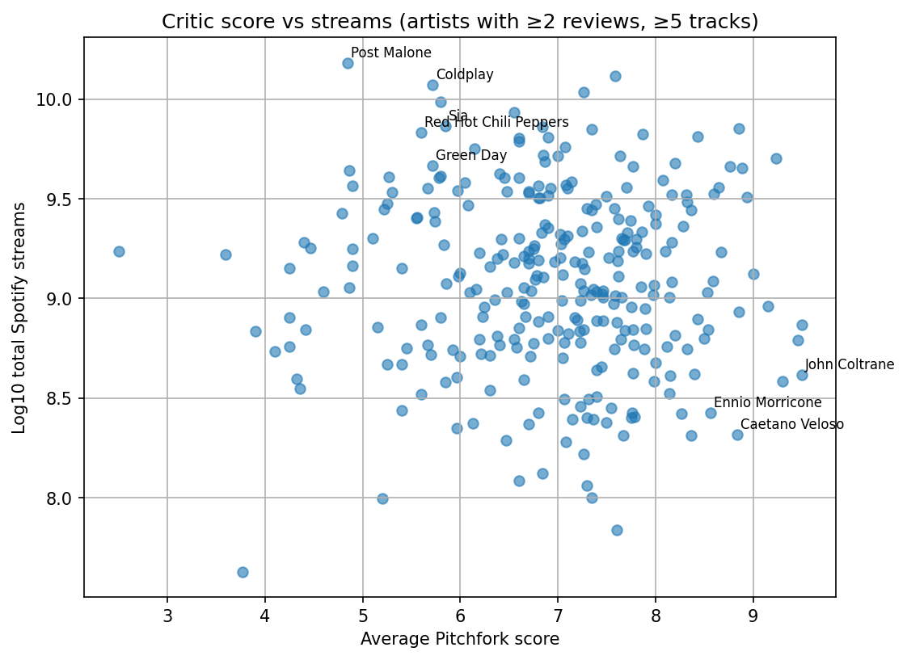

<!-- Python version -->

<!-- License -->

<!-- Repo size -->

<!-- Last commit -->

<!-- Stars -->

# Vinyl Critics vs Streams

This project compares Pitchfork critic scores with Spotify and YouTube streaming performance.  
The aim is to build a clean, reproducible workflow from raw data to analysis and highlight cases where critical reception diverges from mainstream listening patterns.

---

## Project Objectives

- Build a small but realistic ETL process based on Pitchfork and Spotify/YouTube datasets  
- Clean and standardise review data, including multi-artist reviews and date parsing  
- Create a SQLite warehouse with clear dimension and fact tables  
- Perform entity resolution between Pitchfork and Spotify artist names  
- Expose a stable analysis layer through SQL views  
- Explore where critic sentiment aligns or misaligns with streaming popularity  
- Identify artists who are critically acclaimed but commercially underrepresented (and vice versa)

---

## Data Pipeline Overview

### Raw Data

Located under `data/raw/`:

- Pitchfork SQLite dump (reviews, artists, genres, labels)  
- Spotify and YouTube track-level metrics  

### Staging & Cleaning

Scripts in `scripts/` perform:

- Parsing and typing of Pitchfork review fields  
- Splitting multi-artist reviews into a bridge table  
- Fuzzy artist matching using `rapidfuzz`  
- Building intermediate CSVs for validation and loading  

### Data Warehouse

The warehouse lives at `data/processed/vinyl_dw.sqlite`.  
SQL in `sql/dw/` defines the semantic layer.

Key views:

- `vw_review_with_artist`  
- `vw_unmatched_artists`  
- `vw_artist_summary`  
- `vw_artist_streams`  
- `vw_artist_critics_vs_streams`  

These views act as the main entry points for notebooks, dashboards, or external queries.

---

## Architecture

---

## Analytical Notebook

The main analysis is in `notebooks/01_critics_vs_streams.ipynb`.

It covers:

- Loading the warehouse via SQLite + pandas  
- Schema, range, and missing-value checks  
- Log-scaling of skewed streaming metrics  
- Correlation checks between critic scores and streams  
- Identification of outliers (e.g., “underrated” or “overrated” artists)  
- Visualisation of critic vs. streaming relationships  

---

## Key Visualisation

The scatter plot compares average Pitchfork score with the log of total Spotify streams.  
Artists included: at least 2 Pitchfork reviews and 5+ tracks with streaming data.

A small number of outliers are labelled to highlight interesting deviations.

### Interpretation

- The overall correlation between critic favourability and streaming scale is weak.  
- Artists such as Post Malone, Coldplay, Sia, Red Hot Chili Peppers, and Green Day  
  have extremely high streaming counts but only mid-range Pitchfork scores.  
- Highly acclaimed artists such as John Coltrane, Ennio Morricone, and Caetano Veloso  
  sit well below the top streaming tier.  
- The pattern reflects a common reality:  
  critics emphasise artistry and influence,  
  while streaming ecosystems amplify virality, playlisting, and algorithmic reach.

### Example Outliers (labelled in the plot)

| Artist                | Avg Score | Log10 Streams | Reviews | Tracks |
|-----------------------|-----------|---------------|---------|--------|
| Post Malone           | 4.85      | 10.18         | 2       | 10     |
| Coldplay              | 5.72      | 10.07         | 10      | 10     |
| Sia                   | 5.85      | 9.87          | 4       | 10     |
| Red Hot Chili Peppers | 5.60      | 9.83          | 5       | 10     |
| Green Day             | 5.72      | 9.66          | 5       | 10     |
| John Coltrane         | 9.50      | 8.61          | 3       | 10     |
| Ennio Morricone       | 8.57      | 8.42          | 3       | 10     |
| Caetano Veloso        | 8.84      | 8.31          | 5       | 10     |

---

## Technical Stack

- Python (pandas, numpy, matplotlib)  
- SQLite for the warehouse  
- rapidfuzz for string matching  
- Jupyter Notebook for exploratory work  
- Modular ETL scripts for loading and transformation  

---

## Possible Extensions

- Add manual mapping overrides to refine fuzzy artist matching  
- Introduce Spotify popularity indexes and playlist exposure features  
- Expand analysis to track-level correlations  
- Build a lightweight dashboard (Streamlit, Dash, or SQLite + Metabase)  
- Add regression or clustering models to understand the drivers of popularity  

---

## Purpose of the Project

The repository demonstrates an end-to-end workflow that is typical in data engineering and analytics:

- ingesting heterogeneous data  
- cleaning and standardising inconsistent structure  
- resolving entities between sources  
- modelling the data into a warehouse  
- exposing semantic views for analysis  
- performing exploratory analytics and visualisation  

It is designed as a compact, realistic example of how a full analytics workflow is built and communicated.

